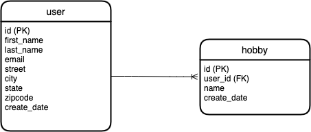

# Database Tutorial

For this tutiorial we will use SQLite and DB Browser for SQLite (https://sqlitebrowser.org/dl/)


## Create tables in database

```
CREATE TABLE "user" (
	"id"	INTEGER PRIMARY KEY AUTOINCREMENT,
	"firstname"	VARCHAR(80),
	"lastname"	VARCHAR(80),
	"email"	VARCHAR(120),
	"street"	VARCHAR(200),
	"city"	VARCHAR(50),
	"state"	VARCHAR(50),
	"zipcode"	VARCHAR(50),
	"create_date"	DATETIME
);

CREATE TABLE "hobby" (
	"id"	INTEGER PRIMARY KEY AUTOINCREMENT,
	"name"	VARCHAR(200),
	"user_id"	INTEGER,
	"create_date"	DATETIME,
	FOREIGN KEY("user_id") REFERENCES "user"("id")
);
```

## Entity Relationship (ER) Diagram


## CRUD
Create, Read, Update, Delete

## Create
```
insert into user (firstname, lastname, email, street, city, state, zip code, create_date) values (“Erwin”, “Alberto”, “ealberto@me.com”, “123 main st”, “Jacksonville”, “Florida”, “32256”, “2020-05-26”)

insert into hobby (name, user_id, create_date) values (“Programming”, “1”, “2020-05-06”)
```

## Read
```
select * from hobby

select * from user

select * 
from user a, hobby b
where a.id = b.user_id
```

## Update
```
update user
set firstname = "jack"
where id = 2
```

## Delete
```
delete from user where id = 2
```
