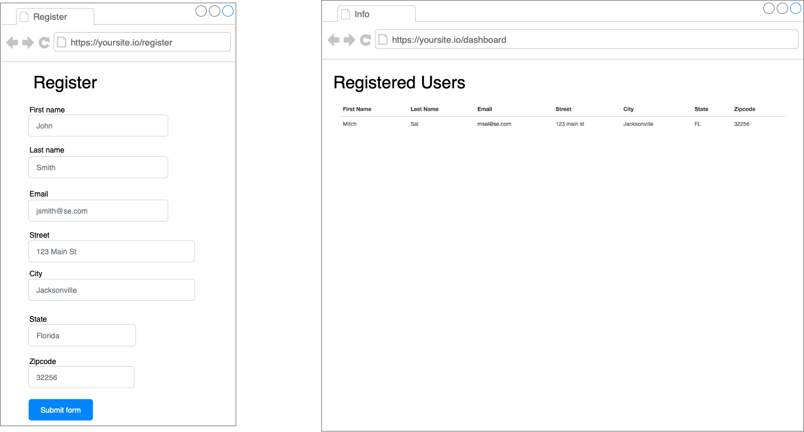
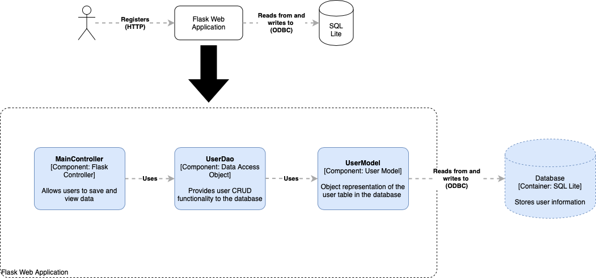

# SheCanCodeIT Project Spec

For this project, we will build a very simple web application.  The application we will build will take in a registration data and save it to the database.  After you have saved it in the database, we will then read that information back.  Here is a screenshot of what we will build

## Architecture
The application that we will build will be a traditional web application.  It will follow the Model-View-Controller (MVC) pattern.  In essence we will build a controller object (maincontroller.py), a data access object (userdao.py) and a model object (usermodel.py).

